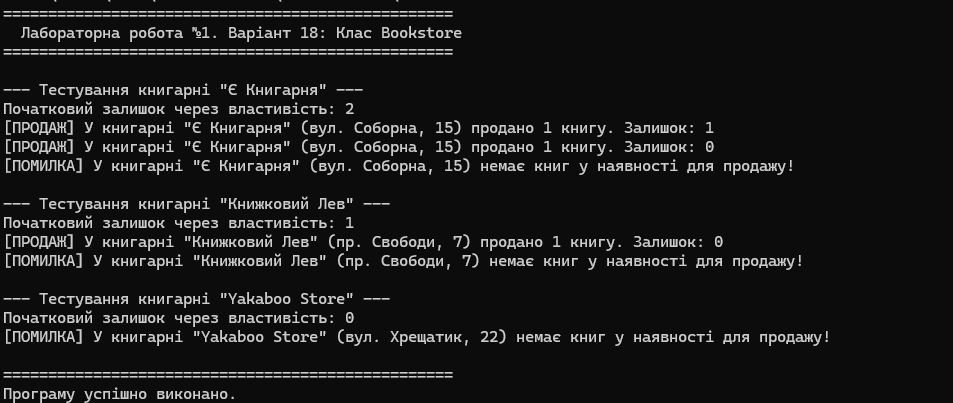

# Лабораторна робота №1

## Тема

Створення класів та об'єктів у C#.

## Мета

Навчитися створювати класи та об'єкти, використовувати поля, властивості, конструктори та методи.

## Варіант

**18 — Bookstore**

## Завдання

Потрібно створити клас `Bookstore`, який описує книжковий магазин.

Клас має:

- назву магазину;
- місце розташування;
- кількість доступних книг;
- метод для продажу книги.

## Хід роботи

Було створено клас `Bookstore`.

У класі використано поля:

- `name` — назва магазину;
- `location` — місце розташування;
- `BooksAvailable` — кількість книг.

Також було створено метод `SellBook()`, який імітує продаж книги.

Після цього в `Program.cs` було створено декілька об'єктів класу `Bookstore` та перевірено їх роботу.

## Приклад результату

