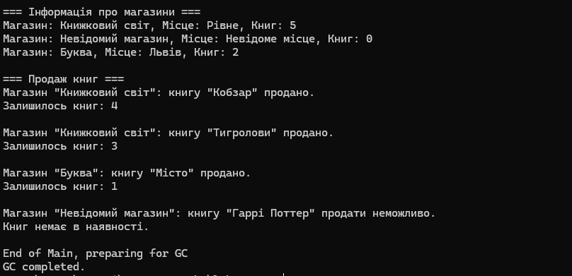

# Лабораторна робота №2

## Тема

Робота з класами, властивостями, конструкторами, методами та деструкторами в C#.

## Мета

Навчитися створювати класи з приватними полями, властивостями, конструкторами та методами. Ознайомитися з роботою деструктора та збирача сміття.

## Варіант

**18 — Bookstore**

## Завдання

Створити клас `Bookstore`, який описує книжковий магазин.

Клас має:

- приватне поле `_name` — назва магазину;
- приватне поле `_location` — місце розташування;
- приватне поле `_booksAvailable` — кількість доступних книг;
- властивості `Name`, `Location`, `BooksAvailable`;
- два конструктори;
- метод `SellBook()`;
- деструктор.

## Хід роботи

Було створено клас `Bookstore`.

У класі використано приватні поля:

- `_name`;
- `_location`;
- `_booksAvailable`.

Також було створено публічні властивості для роботи з цими полями.

Для властивостей `Name` та `Location` додано перевірку, щоб значення не були порожніми.

Властивість `BooksAvailable` доступна тільки для читання.

## Конструктори

Було створено два конструктори.

Перший конструктор приймає назву магазину, його місце розташування та кількість книг.

Другий конструктор не має параметрів та викликає перший конструктор за допомогою `this()`.

## Метод

Було створено метод `SellBook(string bookTitle)`.

Метод використовується для продажу книги. Після продажу кількість доступних книг зменшується на одну.

Якщо книг немає, програма повідомляє про це.

## Деструктор

Також було створено деструктор, який виводить повідомлення про знищення об'єкта.

Для перевірки його роботи в кінці програми використано:

```csharp
GC.Collect();
GC.WaitForPendingFinalizers();

```

## Приклад результату
