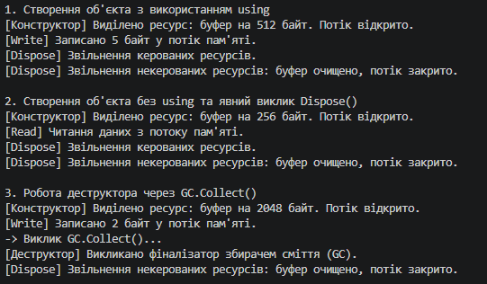

# Лабораторна робота №3 — Реалізація IDisposable та паттерну Dispose (Варіант 18)[cite: 4]

## Про проєкт
У цій лабораторній роботі я реалізував власний клас `MyMemoryStream`, який імітує потік у пам'яті[cite: 4]. Головна мета — розібратися з правильним управлінням ресурсами в .NET за допомогою інтерфейсу `IDisposable`, деструктора та збирача сміття (`Garbage Collector`)[cite: 4].

## Реалізація

### Поля та властивості
Для імітації роботи потоку додано приватні поля `_buffer` (байт-масив), `_isOpen` (стан) та прапорець `_disposed` для відстеження звільнення ресурсів[cite: 4]. Також створив властивості `IsOpen` та `Capacity`[cite: 4].

### Конструктор та роботи з даними
Конструктор `MyMemoryStream(int size)` виділяє пам'ять під буфер та відкриває потік[cite: 4]. Методи `Write(byte[] data)` та `Read()` відповідають за запис і читання[cite: 4]. Перед кожною операцією проводиться перевірка, чи не був потік закритий[cite: 4].

### Патерн Dispose
Реалізовано стандартний механізм очищення ресурсів[cite: 4]:
* `Dispose(bool disposing)` — захищений метод, який звільняє буфер і закриває потік[cite: 4].
* `Dispose()` — публічний метод інтерфейсу, що викликає `Dispose(true)` та відключає фіналізацію через `GC.SuppressFinalize(this)`[cite: 4].
* `~MyMemoryStream()` — деструктор, який викликає `Dispose(false)` на випадок, якщо `Dispose()` не викликали вручну[cite: 4].

### Демонстрація в Main
У програмі продемонстровано три варіанти роботи з об'єктом[cite: 4]:
1. Через конструкцію `using`[cite: 4].
2. З явним викликом `.Dispose()`[cite: 4].
3. Без виклику `Dispose()` — перевірка автоматичного спрацювання деструктора через `GC.Collect()`[cite: 4].

## Приклад результату

