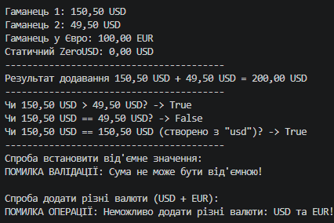

# Лабораторна робота №4 — Властивості, статичні члени та перевантаження операторів (Варіант 18)

## Про проєкт
У цій лабораторній роботі я реалізував власний клас `CurrencyAmount`, який представляє грошову суму у певній валюті. Головна мета — навчитися створювати властивості з валідацією, статичні члени та перевантажувати стандартні оператори в C#.

## Реалізація

### Поля та властивості
Додано приватні поля `_value` та `_code`. 
Реалізовано властивості з валідацією:
* `Value` — перевіряє, щоб сума не була від'ємною (`>= 0`).
* `Code` — перевіряє, щоб код валюти не був порожнім, і автоматично приводить його до верхнього регістру (наприклад, "USD").

### Статичний член
Додано статичну властивість `ZeroUSD`, яка повертає готовий об'єкт `CurrencyAmount` зі значенням 0 USD.

### Перевантаження операторів
* `+` — додає дві суми за умови, що їхні валюти збігаються.
* `>`, `<`, `>=`, `<=` — порівнюють значення двох сумарних величин в однаковій валюті.
* `==`, `!=` — перевіряють об'єкти на рівність (перевизначено разом із `ToString()`, `Equals()` та `GetHashCode()`).

## Демонстрація в Main
У програмі продемонстровано:
1. Створення об'єктів та використання статичної властивості `ZeroUSD`.
2. Додавання двох сум в однаковій валюті через оператор `+`.
3. Порівняння об'єктів через оператори `>`, `==` та `!=`.
4. Обробку помилок (перехоплення `ArgumentException` при спробі задати від'ємну суму та `InvalidOperationException` при додаванні різних валют).

## Приклад результату
