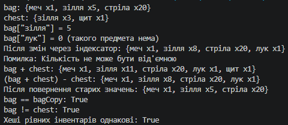

# Лабораторна робота №5 — Індексатори та перевантаження операторів (Варіант 18)

## Про проєкт

У цій лабораторній роботі я реалізував клас `Inventory` (інвентар), який зберігає предмети та їх кількість. Мета — навчитися створювати індексатори та перевантажувати оператори для власних типів.

## Реалізація

### Клас Inventory

Дані зберігаються в приватному полі `Dictionary<string, int> _items` (предмет → кількість).

- **Індексатор** `this[string itemName]` — читання й запис кількості предмета за назвою. Якщо предмета немає, при читанні повертається `0`. Запис `0` видаляє предмет, від'ємне значення викликає виняток.
- **Оператор `+`** — об'єднує два інвентарі, складаючи кількості однакових предметів.
- **Оператор `-`** — віднімає кількості; предмети, кількість яких стала нульовою або від'ємною, зникають.
- **Оператори `==` та `!=`** — порівнюють вміст інвентарів (порядок предметів не важливий).
- **Перевизначені методи** `ToString()`, `Equals()` і `GetHashCode()`.
- **Додатково**: метод `AddItem(string item, int quantity)` та властивість `Count`.

## Демонстрація в Main

1. Створено три об'єкти `Inventory`: `bag`, `chest` і `bagCopy`.
2. Показано читання та запис елементів через індексатор, а також обробку неіснуючого предмета і від'ємної кількості.
3. Показано роботу операторів `+`, `-`, `==` та `!=`.
4. Перевірено, що рівні інвентарі мають однаковий хеш-код.

## Приклад результату

