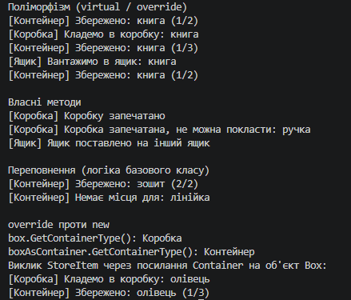

# Лабораторна робота №6 — Наслідування. base, override, virtual, new (Варіант 18)

## Про проєкт

Реалізовано ієрархію контейнерів: базовий клас `Container` та похідні `Box` і `Crate`. Мета — зрозуміти virtual/override, виклик `base(...)` та різницю між перевизначенням і приховуванням (`new`).

## Реалізація

- `Container` — поля `Capacity`, `Material`, конструктор, віртуальний метод `StoreItem(string item)` і звичайний метод `GetContainerType()`.
- `Box` — поле `IsSealed`, `override StoreItem()`, метод `CloseBox()`, `new GetContainerType()`.
- `Crate` — поле `IsStackable`, `override StoreItem()`, метод `StackCrate()`.

## Демонстрація в Main

1. Масив `Container[]` з об'єктами всіх трьох класів, виклик `StoreItem()` у циклі показує поліморфізм.
2. Виклик власних методів `CloseBox()` і `StackCrate()`.
3. Порівняння `override` і `new`: `GetContainerType()` через `Box` і через `Container` повертає різні значення.

## Приклад результату

