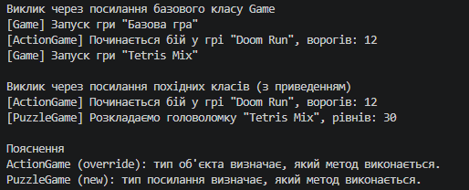

# Лабораторна робота №7 — Приховування методів (new) vs перевизначення (override) (Варіант 18)

## Про проєкт

Реалізовано ієрархію ігор: базовий клас `Game` та похідні `ActionGame` (override) і `PuzzleGame` (new). Мета — побачити різницю між динамічним зв'язуванням і приховуванням методів.

## Реалізація

- `Game` — властивість `Title`, конструктор, віртуальний метод `Start()`.
- `ActionGame` — властивість `Enemies`, `override Start()`.
- `PuzzleGame` — властивість `Levels`, `new Start()`.

## Демонстрація в Main

1. Створено об'єкти `Game`, `ActionGame` і `PuzzleGame`, останні два збережено у змінних типу `Game` (upcasting).
2. Виклик `Start()` через посилання базового класу: `ActionGame` виконує свою версію, `PuzzleGame` виконує версію `Game`.
3. Виклик через посилання похідних класів з приведенням: виконуються власні версії обох класів.

## Приклад результату

