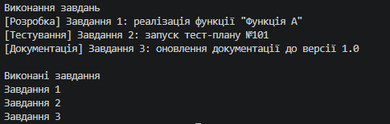

# Лабораторна робота №8 — Поліморфізм: динамічне зв'язування та перевизначення методів (Варіант 18)

## Про проєкт

У цій лабораторній роботі я реалізував ієрархію поліморфних завдань: базовий клас `WorkItem` та три похідні класи — `DevelopmentTask`, `TestingTask` і `DocumentationTask`. Мета — зрозуміти, як працюють віртуальні методи, їх перевизначення та динамічне зв'язування.

## Реалізація

### Базовий клас

`WorkItem` містить властивість `Title`, конструктор та віртуальний метод `Execute()`, який похідні класи можуть перевизначати.

### Похідні класи

Кожен клас має власне поле, конструктор (що передає `Title` у базовий клас через `base`) та `override Execute()` з унікальною поведінкою:

- `DevelopmentTask` — поле `FeatureName`, виводить повідомлення про реалізацію функції.
- `TestingTask` — поле `TestPlanId`, виводить повідомлення про запуск тест-плану.
- `DocumentationTask` — поле `DocVersion`, виводить повідомлення про оновлення документації.

## Демонстрація в Main

1. Створено колекцію `List<WorkItem>` і додано до неї по одному об'єкту кожного похідного класу.
2. У циклі `foreach` для кожного об'єкта викликається `Execute()`. Завдяки динамічному зв'язуванню спрацьовує реалізація фактичного типу об'єкта, а не базового класу.
3. Агрегація: оскільки `Execute()` нічого не повертає, після кожного виклику назва завдання додається до списку `executed`, який наприкінці виводиться як перелік усіх виконаних завдань.

## Приклад результату

